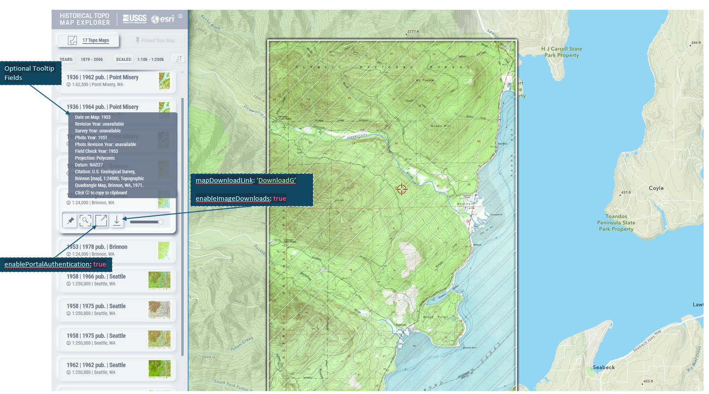

# Historical Topographic Map Explorer

A collection of topographic maps throughout the United States and territories provided by the [USGS]. The app contains over 180,000 maps dating from 1882 to 2006. Users can explore these maps in their geographical context and discover all the relevant maps in that area.

## Features

- Explore the catalog of historic topographic maps available at locations within the United States
- Display images of the topographic maps that overlay the basemap, giving context to the map's surrounding area
- Save selected maps as a web map to your ArcGIS Online account
- Download selected maps

### Requirements

#### Installation

- Clone the repository, or download and unzip the file, in the root folder of a web server.

## Instructions

### Configuration

Some elements of the application can be modified. Any changes to the app will be made in the 'app-config.js' file found in the root folder.

The 'app-config.js' file can be used for re-configuring aspects of the application like: the webmap, image service, filters, data from the service and some styling in the app can be adjusted.

### Application Settings

You can change the image service this app uses to connect your own service to the mechanics of the application. Elements needed to reconfigure a new image service to the app are described below.

The application can also be authorized to access secure resources (like a portal, location service, maps, layers, or data service). Values for the components used in authentication are also listed below.

| Component                    | Value   | Description                                                                                                                                                                                                                                                                                     |
| ---------------------------- | ------- | ----------------------------------------------------------------------------------------------------------------------------------------------------------------------------------------------------------------------------------------------------------------------------------------------- |
| `appId`                      | String  | Identification key for application authentication to access secure resources. Register your app with your own App Id. For more info, see https://developers.arcgis.com/documentation/security-and-authentication/.                                                                              |
| `portalURL`                  | URL     | The website (containing the URL and domain) to the portal. The default portal is `https://www.arcgis.com/`.                                                                                                                                                                                     |
| `enablePortalAuthentication` | Boolean | If your application will connect users to a portal, this component will enable the users to authenticate their account. Once successfully authenticated the user can save selected maps from the app to their portal content. This application will have the authentication enabled by default. |

### Webmap & Layers

#### Webmap

The webmap of the application can be changed. Details for changing the webmap and it's associated properties are listed here.

| Component  | Value  | Description                                                                                                                  |
| ---------- | ------ | ---------------------------------------------------------------------------------------------------------------------------- |
| `webMapID` | String | The esri (or other portal) item ID of the webmap. This ID is used in the `portalItem` property when constructing the webmap. |

#### Default Map Settings

The default settings of the map are can be adjusted for specific needs. More information on properties of the map instance can be found at the esri JS API's [map documentation] page.

| Map Settings | Value            | Description                                                                                                                                                                                                           |
| ------------ | ---------------- | --------------------------------------------------------------------------------------------------------------------------------------------------------------------------------------------------------------------- |
| `center`     | [Number, Number] | The center point coordinates of the map. Expects an array of two numbers ([longitude, latitude]). The default coordinates are set to the approximate center of the continental United States at, [-98.5357, 40.1549]. |
| `zoom`       | Number           | The specific level of detail (LoD) or zoom level that applies to the map as it's initiated. This default expectation is a number between 3 and 22                                                                     |
| `minZoom`    | Number           | This number dictates the minimum zoom level constraint (i.e.: the top-most 'zoom level', the farthest zoom-out possible). The application's default constraint is 3.                                                  |

#### Layer List and Toggle Element

Layers associated with the webmap can be used in the application's 'Layer List Toggle'. The layer toggle element is given an array of objects that contain the name of the layer in the webmap, and the name (or title) that layer will be given in the layer toggle element.

An important note, the layer toggle expects that the layers provided (the layers in the `webmapLayersForToggleElement` array) are present in the webmap. If a layer id in the array is not present, the application will throw an error.

The layer list toggle element will contain up to 4 layers at a maximum.

| Layer Information              | Value            | Description                                                                                                                                                                                                                                                                                                                                            |
| ------------------------------ | ---------------- | ------------------------------------------------------------------------------------------------------------------------------------------------------------------------------------------------------------------------------------------------------------------------------------------------------------------------------------------------------ |
| `enableBasemapToggleElement`   | Boolean          | Determines whether or not the 'Layer List Toggle' element will be initialized on the application boot-up. Default value is 'true'                                                                                                                                                                                                                      |
| `webmapLayersForToggleElement` | Array of objects | An array of objects that contain attributes (`layerId`, `layerTitle`) for the 'layer list toggle element'. The `layerId` attribute determines which layer in the webmap will be used in the toggle element. The `layerTitle` attribute states what name will be given to the layer in the element. The toggle element expects a maximum of four layers |

### Image Service & Data

#### URL and Service Endpoint

You can configure parameters related to queries, which are used to find the images that the user wants to see from the image service:

| Component                | Value  | Description                                                                                                                                                                                                                                                  |
| ------------------------ | ------ | ------------------------------------------------------------------------------------------------------------------------------------------------------------------------------------------------------------------------------------------------------------ |
| `ImageServerURL`         | String | Expects a valid URL to an ArcGIS image service. The default URL points to the USGS Historical Topographic Map Collection                                                                                                                                     |
| `whereStatement`         | String | A where clause that filters the query to the image service. The default clause is `1=1`, which asks for every entry in the service                                                                                                                           |
| `imageThumbnailEndpoint` | String | Expects a file path endpoint connected to the `imageServiceURL`. The relative path to the thumbnails resource associated with the image service. The default path is `/info/thumbnail` (because these thumbnails are a child resource to the image service). |

### Fields Used in this Service

The following are the fields from the service that the application leverages. Some of these fields are inherent and are <b>required</b> for the app to run as expected; The data from these 'required' fields will be rendered on the map-item's in the list of maps. There are additional optional fields that are used to augment the information for the images provided and are optional. Regardless if the fields is required or not, if you intend to use a field, THE FIELD VALUE MUST MATCH the attribute field names in the image service table used with the application.
| Field | Value | Required or Optional | Description |
| ----------------- | ----------------- | ------- | ----------------- |
| `objectId` | String | Required | The default value for this service is: `OBJECTID`. This value should not be modified. |  
| `mapName` | String | Required | The default is value is `Map_Name`. The name (or title) of the image. This value determines the alphabetical sort order. The value is rendered in the list of maps in the sidebar|
| `publicationYear` | String | Required | Year of the image's publication. Will appear with the map's information. The default string value for this service is `Imprint_Year` |
| `dateCurrent` | String | Required | Date of the image as a year (in #### format). This field in the default image service is `DateCurrent`. This value determines the chronological sort order of the maps, and the years (or date) filter. |
|`mapScale`| String | Required | Map scale of the image in the service. Expects a number value in the thousands (e.g: #,###). This field is `Map_Scale` in the default service. |
|`mapDownloadLink`| String | Required | The download link for the the image. If this field is not used in the app, the download icons for the map-items will be removed. The default field is `DownloadG` for this image service. This is the only optional field that will render on the map list item|
|`mapLocation` | String | Optional | The image's specified location (county, town, state, provence, canton). This value will be paired with the`mapName`value as the subtitle of the map item (e.g.:`mapName`, `mapLocation`). This field is `State` in the default service. |
| `surveyYear` | String | Optional | The year when a field survey was completed. The default field for the service is `Survey_Year` |
|`photoYear` | String | Optional | The year of the aerial photography used in the creation of the map. The default field name for this service is `Aerial_Photo_Year` |
|`photoRevisionYear`| String | Optional | The year when new photos were used to revise a map. The default field name for this service is `Photo_Revision_Year` |
|`fieldCheckYear` | String | Optional | The year the map content was last verified in the field. The default field name for this service is `Field_Check_Year` |
|`projection` | String | Optional | A mathematical model used to represent the spherical shape of the earth’s surface on a flat surface (paper map). This field identifies the specific projection used to create the map. The default fieldname for this service is `Projection`|
|`datum` | String | Optional | A mathematical model that approximates the size and shape of the earth. This field is used to identify the specific datum used to create the map. The default field name for this service is `Datum` |
|`citation` | String | Optional | The citation provided by the USGS. The default field name for the service is `Citation`|

Additional components of the map-item's card can be adjusted. Both the 'map-image download' and the 'export map to ArcGIS Online' features can be turned on or off.

| Component                    | Value   | Description                                                                                                                                                                                                                                                    |
| ---------------------------- | ------- | -------------------------------------------------------------------------------------------------------------------------------------------------------------------------------------------------------------------------------------------------------------- |
| `enableImageDownloads`       | Boolean | Adds the download icon to each map-item. Allows the user to download that specific image. If the 'mapDownloadLink' field is not needed or does not provide a valid return, the icon will not be rendered for the map-item in the list. Default value is `true` |
| `enablePortalAuthentication` | Boolean | If the application connects users to a portal, this component will enable the users to authenticate their account. If set to 'true' renders the 'save/export map' button to the map-item. Default value is `true`                                              |

### Filter Sliders

The app has two slider filters: one that filters maps by year, and another that filters by the scale. These filters can be turned on or off; there is a general component that determines if filter sliders will be used and settings for each individual slider filter.

| Component                  | Value   | Description                                                                                                            |
| -------------------------- | ------- | ---------------------------------------------------------------------------------------------------------------------- |
| `enableSliders`            | Boolean | Controls whether or not both sliders will be initiated in the application. The default state of this co set to `true`. |
| `enableTimeFilterSliders`  | Boolean | The value determines if the time (year) slider will be initialized when the app loads. The default value is `true`.    |
| `enableScaleFilterSliders` | Boolean | The value determines if the time (scale) slider will be initialized when the app loads. The default value is `true`.   |

>

### Search Widget

Settings for the search widget, adjustments can be made to the geocode source, and region (through country code) of the search options library. The placeholder prompt for the input text can also be changed.

| Widget Settings    | Value  | Description                                                                                                                                                                                                         |
| ------------------ | ------ | ------------------------------------------------------------------------------------------------------------------------------------------------------------------------------------------------------------------- |
| `geocodeSourceURL` | String | The default ArcGIS World Geocoding Service URL. The default URL is, https://geocode.arcgis.com/arcgis/rest/services/World/GeocodeServer                                                                             |
| `countryCode`      | String | A country code that limits recommended search results to that specific country. Uses the [country ISO codes] as described by the ISO 3166 international standard. The default setting for the country code is 'US'. |
| `placeholderText`  | String | Hint for the input field of the search widget. The current prompt is 'Find address or place'                                                                                                                        |

### Application Header Styling

You can configure the appearance of some of the application's components (the title, header, sidebar, map)

| Component        | Value            | Description                                                                                                                                                                                                                                                                                                                                                                                                                                                                                                                                    |
| ---------------- | ---------------- | ---------------------------------------------------------------------------------------------------------------------------------------------------------------------------------------------------------------------------------------------------------------------------------------------------------------------------------------------------------------------------------------------------------------------------------------------------------------------------------------------------------------------------------------------- |
| `appHeaderName`  | String           | Name or title of the application at the top of the sidebar. The default value of this component is 'Historical Topo Map Explorer'.                                                                                                                                                                                                                                                                                                                                                                                                             |
| `appTitleName`   | String           | The title of the application rendered on the browser's tab. The default string is 'Historical Topo Map Explorer'.                                                                                                                                                                                                                                                                                                                                                                                                                              |
| `appHeaderColor` | Hexadecimal      | Color of the sidebar header. The default color is '#ABB4C2'                                                                                                                                                                                                                                                                                                                                                                                                                                                                                    |
| `headerLogoImgs` | Array of Objects | Array containing objects of image attributes (`imageSrc`, `altText`) to be placed in the sidebar header. The `imageSrc` attribute expects a URL or file path to the image. The default img src's for the application's header are: ./public/images/usgs_logo.png and ./public/images/esri-10GlobeLogo_1CRev.png. The `altText` is an optional attribute that expects a string to be used as a fallback for problems with the image's display or share information about the image. By default the application expects a maximum of two images. |

### Map Image & Map-item Mouse Over Styles

#### Mouse Over Style

The color of the map outline and its fill while hovering over a map-item card can be adjusted.

| Component                   | Value  | Description                                                                                                       |
| --------------------------- | ------ | ----------------------------------------------------------------------------------------------------------------- |
| `hoverHighlightBorderColor` | [RGBA] | Border color of the map's outline during the map-item hover event The default value is [255, 255, 255, 255].      |
| `hoverHighlightFillColor`   | [RGBA] | Fill color of the map's interior color during the map-item hover event. The default value is [255, 255, 255, 160] |

#### Map Image Styling

The border and fill color of the map image can be modified as well.

| Component             | Value       | Description                                                   |
| --------------------- | ----------- | ------------------------------------------------------------- |
| `mapImageBorderColor` | Hexadecimal | Color of the map image border. Default value is '#FFFFFF'     |
| `mapImageFillColor`   | Hexadecimal | Color of the map image's fill. The default value is '#7f7f7f' |

#### Resources

The image service and its associated data used in this application can be found in [ArcGIS Living Atlas of the World]. The image service the app is using is the [USGS Historical Topograhpic Maps Collection].

#### Issues

If you find a bug and want to let us know, please submit an issue.

#### Contributing

Esri welcomes contributions from anyone and everyone. Please see our [guidelines for contributing](https://github.com/esri/contributing).

#### License

Copyright 2024 Esri

Licensed under the Apache License, Version 2.0 (the "License"); you may not use this file except in compliance with the License. You may obtain a copy of the License at

http://www.apache.org/licenses/LICENSE-2.0

Unless required by applicable law or agreed to in writing, software distributed under the License is distributed on an "AS IS" BASIS, WITHOUT WARRANTIES OR CONDITIONS OF ANY KIND, either express or implied. See the License for the specific language governing permissions and limitations under the License.

A copy of the license is available in the repository's [license.txt] file.

#### Contact

For questions or comments about the Topo Explorer app, please contact us at [topoexplorer@esri.com]

Released in 2025

John Nelson - Cartography & Design

Calvin Manning - Application Developer

[//]: # 'Reference links'
[zip]: #
[USGS]: https://www.usgs.gov/programs/national-geospatial-program/historical-topographic-maps-preserving-past
[Portal]: https://developers.arcgis.com/documentation/portal-and-data-services/portals/introduction/
[OAuth 2.0]: https://oauth.net/2/
[Demo]: https://livingatlas.arcgis.com/topomapexplorer/
[map documentation]: https://developers.arcgis.com/javascript/latest/api-reference/esri-views-MapView.html
[country ISO codes]: https://en.wikipedia.org/wiki/List_of_ISO_3166_country_codes
[ArcGIS Living Atlas of the World]: https://livingatlas.arcgis.com/
[USGS Historical Topograhpic Maps Collection]: https://www.arcgis.com/home/item.html?id=ee19794feeed4e068ba99b2ddcb6c2db
[license.txt]: ./LICENSE.txt
[topoexplorer@esri.com]: mailto:topoexplorer@esri.com
